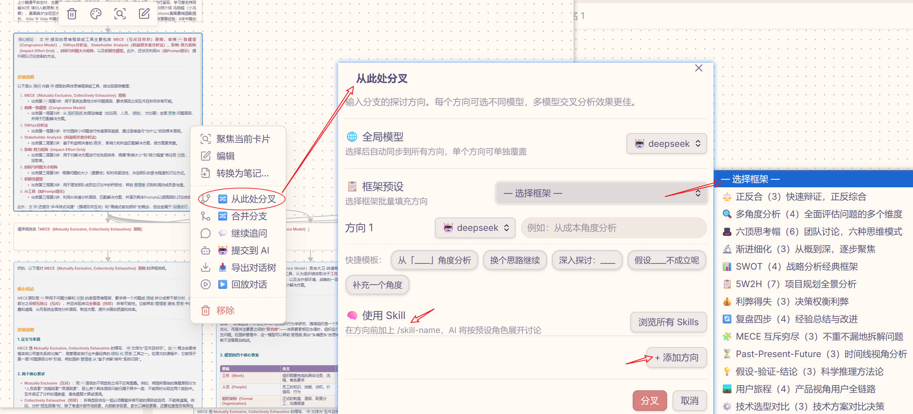
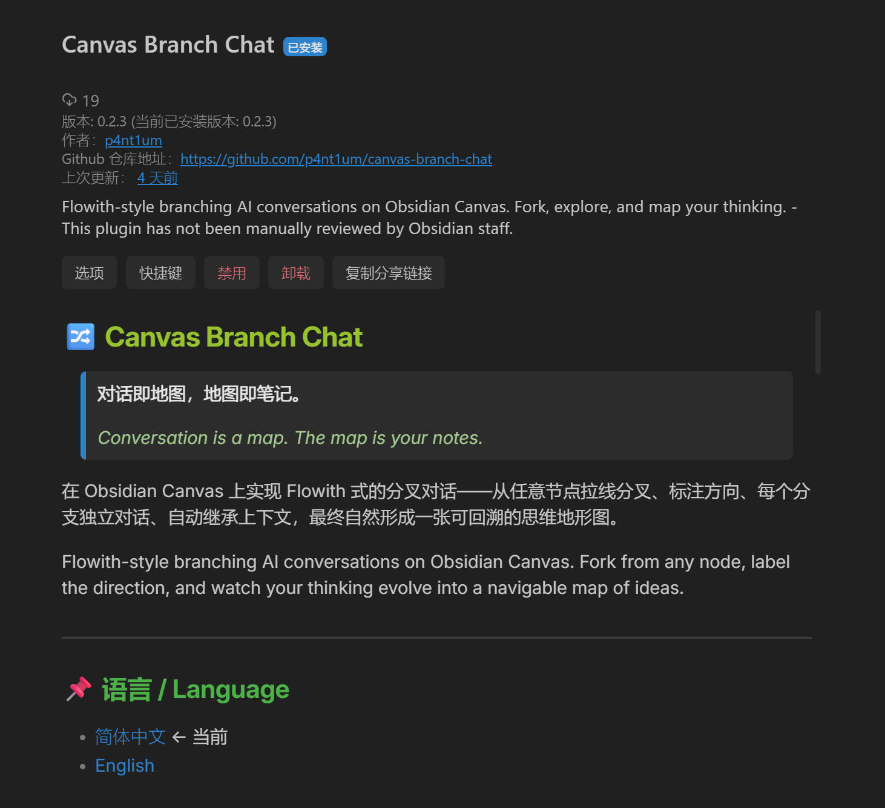

# 🔀 Canvas Branch Chat

> **对话即地图，地图即笔记。**
>
> *Conversation is a map. The map is your notes.*

在 Obsidian Canvas 上实现 Flowith 式的分叉对话——从任意节点拉线分叉、标注方向、每个分支独立对话、自动继承上下文，最终自然形成一张可回溯的思维地形图。

Flowith-style branching AI conversations on Obsidian Canvas. Fork from any node, label the direction, and watch your thinking evolve into a navigable map of ideas.

---

## 📸 预览 / Screenshots



*多方向分叉对话 + 框架预设 + 模型选择 — 中文界面*



*语言设置：跟随系统 / 简体中文 / English*

---

## 📌 语言 / Language

- [简体中文](#简体中文) ← 当前
- [English](#english)

---

## 简体中文

### 这是什么？

这不是"又一个 AI 聊天插件"——Obsidian 已经有 Text Generator、Copilot 等。这个插件的真正价值是**把对话变成可浏览的思维地图**：

- 每次分叉都是在地图上开一条新路
- 最终你得到的不只是一段对话，而是一张完整的思考地形图
- 可以回溯、可以导出、可以嵌入你的笔记体系

### 核心功能

| 功能 | 说明 | 状态 |
|------|------|:---:|
| 🔀 从节点分叉 | 右键任意对话节点 → 输入方向 → 创建新的 AI 对话分支 | ✅ |
| 🔀 多方向批量分叉 | 一次输入多个方向，并行生成多条分支 | ✅ |
| 🏷️ 方向标注 | 分叉时输入方向（如"从成本角度分析"），标注在连接线上 | ✅ |
| 🔗 上下文继承 | 沿直系祖先链自动收集对话历史，新分支自带完整上下文 | ✅ |
| 💬 继续追问 | 在当前分支链上追加对话，直线延续 | ✅ |
| 🤖 单次问答 | 不带历史上下文，快速问一句 | ✅ |
| 🎨 多模型配置 | 每个模型独立配置：别名、Provider、Base URL、颜色、图标、系统提示词、Temperature | ✅ |
| 🏷️ 指定模型分叉 | 右键 → 指定模型分叉，不同模型不同视角 | ✅ |
| 🔬 连通性测试 | 配置时一键测试 API 连通性，远端获取模型列表 | ✅ |
| 👁️ 节点视觉区分 | 用户节点灰色、AI 节点用模型配置色，一眼区分谁说的 | ✅ |
| 🌈 分支颜色编码 | 不同分支自动分配不同颜色，一眼看出分叉结构 | ✅ |
| 📤 导出 Markdown | 将整棵对话树导出为带层级缩进、双链引用的 Markdown 文件 | ✅ |
| 📝 节点自动命名 | AI 回答完成后自动写入摘要元数据，Canvas 上不用打开就能看到梗概 | ✅ |
| ⚡ 流式刷新 | token 级流式更新到 Canvas 节点，实时看到 AI 输出 | ✅ |
| 🏷️ 快捷模板 | 分叉弹窗中可点击的模板 chips，一键插入常用方向 | ✅ |
| 🔀 分支合并 | 多分支合并为总结节点 | ✅ |
| ▶️ 回放对话 | 按时间线/广度/深度回放整棵对话树 | ✅ |
| 🌐 多语言 | 简体中文 / English，跟随系统自动切换 | ✅ |

### 效果示意

> 📸 参见上方[预览截图](#-预览--screenshots)

```
                    ┌──[成本角度]──→ [AI回答: 成本...] ──→ [追问] ──→ ...
[问题: 这个方案如何?] ──┼──[安全角度]──→ [AI回答: 安全...] ──→ [追问] ──→ ...
                    └──[换个思路]──→ [AI回答: 换个...] ──→ [追问] ──→ ...
```

### 安装

#### 方式一：手动安装

1. 下载 [最新 Release](https://github.com/p4nt1um/canvas-branch-chat/releases/latest)
2. 解压得到 `main.js`、`manifest.json`、`styles.css`
3. 放到你的 Obsidian vault 插件目录：
   ```
   <你的vault>/.obsidian/plugins/canvas-branch-chat/
   ```
4. Obsidian → 设置 → 第三方插件 → 启用「Canvas Branch Chat」

#### 方式二：从源码构建

```bash
git clone https://github.com/p4nt1um/canvas-branch-chat.git
cd canvas-branch-chat
npm install
npm run build
```

将生成的 `main.js`、`manifest.json`、`styles.css` 复制到插件目录。

### 配置

#### API Key（安全方案）

插件**不会明文存储你的密钥**，而是通过操作系统环境变量读取：

**第一步：在操作系统中设置环境变量**

- **macOS / Linux**：在终端编辑 `~/.bashrc` 或 `~/.zshrc`，添加：
  ```bash
  export DEEPSEEK_API_KEY=你的密钥
  ```
  保存后执行 `source ~/.bashrc` 生效。
- **Windows**：搜索「环境变量」→ 系统属性 → 新建用户变量，变量名填 `DEEPSEEK_API_KEY`，值填你的密钥。

设置完成后**重启 Obsidian**，确保环境变量被加载。

**第二步：在插件设置中填入变量名**

只需要填变量名称 `DEEPSEEK_API_KEY`，不需要填真实密钥。

#### 模型配置

1. 设置页 → 添加模型
2. 填写别名、Provider、Base URL、API Key 环境变量名
3. 点击「测试连接」验证连通性并获取可用模型列表
4. 选择模型，配置颜色、图标、系统提示词

支持任意 OpenAI 兼容 API（DeepSeek、OpenAI、Ollama 本地模型等）。

### 使用

1. 在 Obsidian 中打开一个 Canvas
2. 创建文本节点，输入你的问题
3. 右键节点 → 选择操作：
   - **🔀 从此处分叉** — 输入方向（支持多个），AI 从该角度回答
   - **🏷️ 指定模型分叉** — 选择不同模型/角色进行分叉
   - **💬 继续追问** — 在当前分支链上继续对话
   - **🤖 提交到 AI** — 单次问答，不带历史
   - **📥 导出对话树** — 将整棵对话树导出为 Markdown
4. AI 回答实时流式显示在 Canvas 节点中

### 技术栈

- **平台**: Obsidian Plugin API (Canvas)
- **语言**: TypeScript
- **构建**: esbuild
- **API 协议**: OpenAI 兼容（支持 DeepSeek、OpenAI 等任意兼容端点）
- **基于**: [HinxCorporation/obsidian-canvas-ai](https://github.com/HinxCorporation/obsidian-canvas-ai) (MIT)

---

## English

### What is this?

This is not "yet another AI chat plugin" — Obsidian already has Text Generator and Copilot. The real value of this plugin is **turning conversations into navigable thinking maps**:

- Each fork opens a new path on the map
- What you get is not just a conversation, but a complete topography of your thinking
- Traceable, exportable, and embeddable in your note system

### Core Features

| Feature | Description | Status |
|---------|-------------|:------:|
| 🔀 Branch from node | Right-click any node → enter direction → create a new AI branch | ✅ |
| 🔀 Multi-direction batch fork | Enter multiple directions at once, generate branches in parallel | ✅ |
| 🏷️ Direction labels | Label each fork with its exploration direction (e.g., "cost analysis") | ✅ |
| 🔗 Context inheritance | Automatically collect conversation history along the ancestor chain | ✅ |
| 💬 Continue chat | Append dialogue on the current branch chain | ✅ |
| 🤖 Quick ask | Single Q&A without history context | ✅ |
| 🎨 Multi-model config | Per-model config: alias, provider, base URL, color, icon, system prompt, temperature | ✅ |
| 🏷️ Choose model to fork | Right-click → pick a specific model/role to branch with | ✅ |
| 🔬 Connectivity test | One-click API test + fetch remote model list | ✅ |
| 👁️ Visual differentiation | User nodes grey, AI nodes use model's color — instantly distinguishable | ✅ |
| 🌈 Branch color coding | Each branch gets a unique color from the palette | ✅ |
| 📤 Export Markdown | Export the entire conversation tree as hierarchical Markdown with wiki links | ✅ |
| 📝 Auto node naming | AI responses auto-write summary metadata for easy scanning on Canvas | ✅ |
| ⚡ Streaming | Token-level streaming updates to Canvas nodes in real time | ✅ |
| 🏷️ Quick templates | Clickable template chips in the branch dialog for common directions | ✅ |
| 🔀 Branch merging | Combine multiple branches into a summary node | ✅ |
| ▶️ Replay | Step through the conversation tree chronologically | ✅ |
| 🌐 i18n | 简体中文 / English, auto-detect system locale | ✅ |

### Example

> 📸 See [screenshots above](#-预览--screenshots)

```
                       ┌──[Cost]──→ [AI: Cost analysis...] ──→ [Follow-up] ──→ ...
[Q: How about this?] ──┼──[Security]──→ [AI: Security...] ──→ [Follow-up] ──→ ...
                       └──[Alt approach]──→ [AI: Alternative...] ──→ [Follow-up] ──→ ...
```

### Installation

#### Option 1: Manual install

1. Download the [latest release](https://github.com/p4nt1um/canvas-branch-chat/releases/latest)
2. Extract `main.js`, `manifest.json`, `styles.css`
3. Place them in your vault's plugin directory:
   ```
   <your-vault>/.obsidian/plugins/canvas-branch-chat/
   ```
4. Obsidian → Settings → Community plugins → Enable "Canvas Branch Chat"

#### Option 2: Build from source

```bash
git clone https://github.com/p4nt1um/canvas-branch-chat.git
cd canvas-branch-chat
npm install
npm run build
```

Copy the generated `main.js`, `manifest.json`, `styles.css` to the plugin directory.

### Configuration

#### API Key (Secure)

The plugin **does not store your key in plaintext**. Instead, it reads from OS environment variables:

**Step 1: Set the environment variable in your OS**

- **macOS / Linux**: Edit `~/.bashrc` or `~/.zshrc`:
  ```bash
  export DEEPSEEK_API_KEY=your-key-here
  ```
  Then run `source ~/.bashrc`.
- **Windows**: Search "Environment Variables" → System Properties → New user variable. Name: `DEEPSEEK_API_KEY`, Value: your key.

**Restart Obsidian** after setting the variable.

**Step 2: Enter the variable name in plugin settings**

Just enter the variable name `DEEPSEEK_API_KEY`, not the actual key.

#### Model Configuration

1. Settings → Add Model
2. Fill in alias, Provider, Base URL, API Key env var name
3. Click "Test Connection" to verify and fetch available models
4. Select model, configure color, icon, system prompt

Supports any OpenAI-compatible API (DeepSeek, OpenAI, Ollama local models, etc.).

### Usage

1. Open a Canvas in Obsidian
2. Create a text node and type your question
3. Right-click the node → choose an action:
   - **🔀 Branch from here** — Enter direction(s), AI responds from that angle
   - **🏷️ Fork with model** — Choose a specific model/role to branch with
   - **💬 Continue chat** — Continue the conversation on the current chain
   - **🤖 Ask AI** — Single Q&A, no history
   - **📥 Export conversation tree** — Export as Markdown
4. AI responses stream into Canvas nodes in real time

### Tech Stack

- **Platform**: Obsidian Plugin API (Canvas)
- **Language**: TypeScript
- **Build**: esbuild
- **API Protocol**: OpenAI-compatible (supports DeepSeek, OpenAI, or any compatible endpoint)
- **Based on**: [HinxCorporation/obsidian-canvas-ai](https://github.com/HinxCorporation/obsidian-canvas-ai) (MIT)

---

## License

MIT

## Roadmap

See [PLAN.md](./PLAN.md) for the full development roadmap.

### P2 (Next)

- Context pruning — selectively exclude ancestor nodes when forking
- Smart follow-up — AI suggests follow-up questions
- Skill scanner integration

### P3 (Future)

- Industry scenario templates (product review, academic debate, security audit)
- MCP tool calls from branch nodes
- Knowledge base RAG integration
- Export as interactive HTML for sharing

## Contributing

Issues and PRs welcome. This is a community project built on top of the MIT-licensed [obsidian-canvas-ai](https://github.com/HinxCorporation/obsidian-canvas-ai).

---

<p align="center">
  <sub>Built with 🧚‍♀️ by Zhang Bin</sub>
</p>
